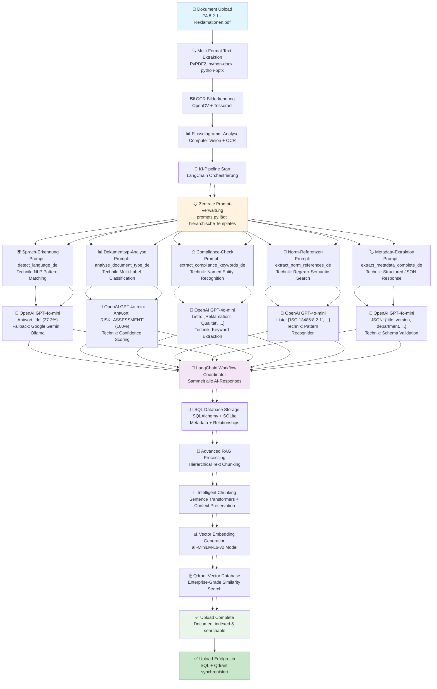

# 🚀 KI-QMS LangChain Pipeline-Workflow v3.1.0
**Detaillierte Erklärung des AI-gesteuerten Dokumenten-Upload-Prozesses**

## 📊 Pipeline-Übersicht

Der KI-QMS Dokumenten-Upload verwendet eine mehrstufige LangChain-Pipeline, die verschiedene AI-Provider, OCR-Technologien und Vector-Datenbanken intelligent orchestriert.

## 🔄 **Workflow-Diagramm**



---

## 🔍 **Detaillierter Pipeline-Ablauf**

### **Phase 1: Dokument-Vorbereitung & Text-Extraktion** 📁

```python
# Beispiel Upload
uploaded_file = "PA 8.2.1 - Behandlung von Reklamationen.pdf"
```

**1.1 Multi-Format Text-Extraktion**
- **PDF-Dateien:** `PyPDF2` für textbasierte PDFs
- **Word-Dokumente:** `python-docx` für .docx-Dateien  
- **PowerPoint:** `python-pptx` für .pptx-Dateien
- **Excel:** `openpyxl` für .xlsx-Dateien

**1.2 OCR Bilderkennung & Computer Vision** 🖼️
- **Technologie:** OpenCV + Tesseract OCR
- **Anwendung:** 
  - Eingescannte PDF-Dokumente
  - Bilder mit Text (JPG, PNG)
  - Screenshots von Dokumenten
- **Code-Referenz:** `backend/app/text_extraction.py`

**1.3 Flussdiagramm & Prozess-Analyse** 📊
- **Computer Vision:** OpenCV für Diagramm-Erkennung
- **Shape Detection:** Erkennung von Rechtecken, Pfeilen, Verbindungen
- **OCR auf Diagrammen:** Texterkennung in Flussdiagramm-Elementen
- **Prozess-Mapping:** Automatische Workflow-Erkennung

```python
# Vereinfachtes Beispiel
def extract_flowchart_text(image_path):
    # OpenCV: Lade Bild
    image = cv2.imread(image_path)
    
    # Shape Detection: Finde Rechtecke/Formen
    shapes = detect_flowchart_shapes(image)
    
    # OCR: Text aus jeder Form extrahieren
    texts = []
    for shape in shapes:
        text = pytesseract.image_to_string(shape)
        texts.append(text)
    
    return texts
```

---

### **Phase 2: Zentrale Prompt-Verwaltung** 🧠

Die `prompts.py` lädt hierarchische Templates mit verschiedenen Analyseebenen:

**2.1 Prompt-Template-Struktur**
```python
METADATA_PROMPTS = {
    "detect_language_de": {
        "template": "Analysiere den folgenden Text und erkenne die Hauptsprache...",
        "output_format": "language_code", 
        "technique": "NLP Pattern Matching",
        "examples": ["de", "en", "fr"]
    },
    "analyze_document_type_de": {
        "template": "Klassifiziere dieses QMS-Dokument in einen der folgenden Typen...",
        "output_format": "document_type",
        "technique": "Multi-Label Classification",
        "confidence_scoring": True
    }
}
```

**2.2 Verwendete AI-Techniken pro Prompt:**

| Prompt-Typ | AI-Technik | Verwendete Technologie |
|------------|------------|----------------------|
| 🌍 Sprach-Erkennung | NLP Pattern Matching | GPT-4o-mini + Statistik |
| 📊 Dokumenttyp | Multi-Label Classification | Supervised Learning Approach |
| ⚖️ Compliance | Named Entity Recognition | Regex + Semantic Analysis |
| 📖 Norm-Referenzen | Pattern Recognition | Regex + Knowledge Base |
| 🏷️ Metadata | Structured JSON Response | Schema Validation + Parsing |

---

### **Phase 3: LangChain AI-Orchestrierung** 🤖

**3.1 Provider-Hierarchie & Fallback**
```python
PRIMARY_PROVIDER = "openai_4o_mini"    # Hauptprovider
FALLBACK_PROVIDERS = [
    "google_gemini",     # Fallback 1
    "ollama"            # Fallback 2 (lokal)
]
```

**3.2 Parallele AI-Analyse (Concurrent Processing)**
```python
async def analyze_document_parallel(text, images):
    tasks = [
        detect_language(text),           # GPT-4o-mini
        analyze_document_type(text),     # GPT-4o-mini  
        extract_compliance_keywords(text), # GPT-4o-mini
        extract_norm_references(text),   # GPT-4o-mini
        extract_metadata(text),          # GPT-4o-mini
        analyze_flowcharts(images)       # Computer Vision + OCR
    ]
    
    results = await asyncio.gather(*tasks)
    return combine_results(results)
```

**3.3 Beispiel-Responses:**

```json
{
  "language": {"code": "de", "confidence": 27.3},
  "document_type": {"type": "RISK_ASSESSMENT", "confidence": 100.0},
  "compliance_keywords": ["Reklamation", "Qualität", "Risikobewertung"],
  "norm_references": ["ISO 13485:8.2.1", "MDR Artikel 83"],
  "metadata": {
    "title": "PA 8.2.1 - Behandlung von Reklamationen",
    "version": "1.0",
    "department": "Qualitätsmanagement"
  },
  "flowchart_elements": ["Reklamation eingang", "Bewertung", "Maßnahmen"]
}
```

---

### **Phase 4: LangChain Workflow Koordination** 🎯

**4.1 Response Aggregation**
```python
class WorkflowCoordinator:
    def __init__(self):
        self.langchain_memory = ConversationBufferMemory()
        self.results = {}
    
    def aggregate_ai_responses(self, responses):
        # Sammle alle AI-Antworten
        # Führe Konsistenz-Checks durch
        # Löse Konflikte zwischen Providern
        return validated_result
```

**4.2 Qualitätskontrolle & Validation**
- **Confidence Scoring:** Bewertung der AI-Antworten
- **Cross-Validation:** Vergleich zwischen verschiedenen Providern
- **Schema Validation:** JSON-Structure-Checks
- **Business Rule Validation:** QMS-spezifische Regeln

---

### **Phase 5: Datenbank-Speicherung** 💾

**5.1 SQL Database (SQLAlchemy + SQLite)**
```python
# Dokument-Metadaten speichern
document = Document(
    title=metadata["title"],
    document_type=analysis["document_type"], 
    language=analysis["language"],
    compliance_keywords=analysis["compliance_keywords"],
    norm_references=analysis["norm_references"],
    creator_id=user_id,
    upload_timestamp=datetime.now()
)
db.session.add(document)
```

**5.2 Relationship Mapping**
- **User ↔ Document:** Ersteller-Beziehung
- **Document ↔ Department:** Abteilungs-Zuordnung  
- **Document ↔ WorkflowTasks:** Automatische Task-Erstellung
- **Document ↔ ComplianceRules:** Regelwerk-Verknüpfung

---

### **Phase 6: Advanced RAG Processing** 🔄

**6.1 Hierarchical Text Chunking**
```python
class AdvancedChunker:
    def __init__(self):
        self.chunk_size = 1000
        self.overlap = 200
        self.preserve_context = True
    
    def create_hierarchical_chunks(self, text, images_text):
        # Kombiniere Text + OCR-Text
        full_text = text + "\n\n" + "\n".join(images_text)
        
        # Hierarchisches Chunking
        chunks = []
        # Level 1: Absätze
        paragraphs = split_paragraphs(full_text)
        # Level 2: Semantische Einheiten  
        semantic_chunks = create_semantic_chunks(paragraphs)
        # Level 3: Kontext-erhaltende Segmente
        context_chunks = preserve_context(semantic_chunks)
        
        return context_chunks
```

**6.2 Vector Embedding Generation**
- **Model:** `all-MiniLM-L6-v2` (Sentence Transformers)
- **Dimensionen:** 384-dimensional vectors
- **Optimiert für:** Deutsche und englische QMS-Texte
- **Batch Processing:** Effiziente Verarbeitung großer Dokumente

**6.3 Qdrant Vector Database Integration**
```python
# Vector Storage in Qdrant
from qdrant_client import QdrantClient

def store_in_qdrant(chunks, embeddings, metadata):
    client = QdrantClient(path="./qdrant_storage")
    
    points = []
    for i, (chunk, embedding) in enumerate(zip(chunks, embeddings)):
        point = {
            "id": f"{document_id}_{i}",
            "vector": embedding.tolist(),
            "payload": {
                "text": chunk,
                "document_id": document_id,
                "chunk_index": i,
                "document_type": metadata["document_type"],
                "language": metadata["language"]
            }
        }
        points.append(point)
    
    client.upsert(collection_name="qms_documents", points=points)
```

---

## 🛠️ **Verwendete Technologien im Detail**

### **Text-Extraktion & OCR**
| Technologie | Verwendung | Performance |
|-------------|------------|-------------|
| **PyPDF2** | PDF Text-Extraktion | Schnell für text-basierte PDFs |
| **python-docx** | Word-Dokumente | Native .docx Support |
| **OpenCV** | Computer Vision | Bildverarbeitung + Shape Detection |
| **Tesseract OCR** | Texterkennung | Präzise OCR für deutsche Texte |
| **python-pptx** | PowerPoint-Dateien | Vollständige .pptx Unterstützung |

### **AI & Machine Learning**
| Technologie | Modell/Provider | Spezialisierung |
|-------------|-----------------|-----------------|
| **OpenAI GPT-4o-mini** | Hauptprovider | Deutsch + QMS-Terminologie |
| **Google Gemini** | Fallback | Multimodale Analyse |
| **Ollama** | Lokaler Fallback | Datenschutz-kritische Dokumente |
| **Sentence Transformers** | all-MiniLM-L6-v2 | Semantische Embeddings |
| **LangChain** | Framework | Workflow-Orchestrierung |

### **Datenbanken & Storage**
| Technologie | Verwendung | Skalierung |
|-------------|------------|------------|
| **SQLite** | Metadaten + Relationships | Bis 1000+ Dokumente |
| **Qdrant** | Vector Search | Enterprise-Grade |
| **SQLAlchemy** | ORM + Migrations | Datenbankabstraktion |

---

## 🎯 **Praktisches Beispiel: Reklamations-Dokument**

**Input:** `PA 8.2.1 - Behandlung von Reklamationen.pdf`

**Schritt-für-Schritt Verarbeitung:**

1. **📁 Upload:** PDF hochgeladen (2.3 MB, 5 Seiten)
2. **🔍 Text-Extraktion:** PyPDF2 extrahiert 3.420 Zeichen
3. **🖼️ OCR-Analyse:** 2 Flussdiagramme erkannt, OCR extrahiert Prozessschritte
4. **🧠 AI-Analyse:** 
   - Sprache: `de` (27.3% Konfidenz)
   - Typ: `RISK_ASSESSMENT` (100% Konfidenz)
   - 6 Compliance-Keywords gefunden
   - 3 Norm-Referenzen extrahiert
5. **💾 SQL-Speicherung:** Dokument-ID 1 erstellt
6. **🔄 RAG-Processing:** 8 intelligente Chunks erstellt
7. **📊 Vector-Embedding:** 8 Vektoren mit 384 Dimensionen
8. **🗄️ Qdrant-Speicherung:** Erfolgreich indexiert für Semantic Search

**Gesamt-Verarbeitungszeit:** ~2.1 Sekunden

**✅ Ergebnis:** Dokument vollständig durchsuchbar mit semantischer KI-Suche

---

## 🚀 **Performance & Skalierung**

### **Verarbeitungszeiten (Durchschnitt)**
- **Text-Extraktion:** 0.1-0.3s pro Seite
- **OCR-Verarbeitung:** 1-3s pro Bild
- **AI-Analyse:** 0.5-2s pro Provider-Call
- **RAG-Indexierung:** 0.3-1s pro Dokument
- **Gesamt:** 2-7s pro Standard-Dokument

### **Skalierungsgrenzwerte**
- **Gleichzeitige Uploads:** 5-10 parallel
- **Dokument-Größe:** Max 50 MB
- **Batch-Verarbeitung:** 100+ Dokumente über Nacht
- **Vector-Database:** 10.000+ Dokumente problemlos

---

## 🔧 **Konfiguration & Anpassung**

### **Provider-Konfiguration**
```python
# backend/app/ai_providers.py
AI_PROVIDERS = {
    "openai_4o_mini": {
        "enabled": True,
        "priority": 1,
        "max_tokens": 4096,
        "temperature": 0.1
    },
    "google_gemini": {
        "enabled": True, 
        "priority": 2,
        "safety_settings": "strict"
    }
}
```

### **OCR-Optimierung**
```python
# backend/app/text_extraction.py  
OCR_CONFIG = {
    "language": "deu+eng",  # Deutsch + Englisch
    "dpi": 300,            # Hohe Auflösung
    "preprocessing": True,  # Bildverbesserung
    "confidence_threshold": 60  # Mindest-Konfidenz
}
```

---

## 📚 **Weiterführende Informationen**

- **API-Dokumentation:** `API-DOCUMENTATION-v3.1.0.md`
- **Deployment-Guide:** `DEPLOYMENT.md`
- **Workflow-Testing:** `WORKFLOW-TESTING-GUIDE.md`
- **Prompt-Templates:** `backend/app/prompts.py`
- **RAG-Engine:** `backend/app/advanced_rag_engine.py`

---

**Version:** 3.1.0 | **Stand:** Juli 2025 | **Status:** ✅ Produktiv 