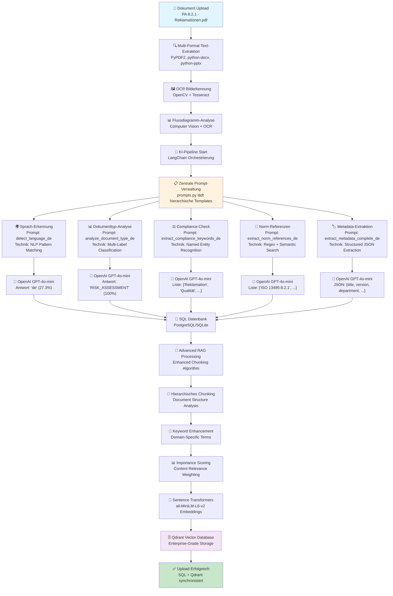

# KI-QMS - AI-Powered Quality Management System 🏥

> **Version 3.1.0** | Ein intelligentes, ISO 13485-konformes Qualitätsmanagementsystem für die Medizintechnik mit KI-Unterstützung
> 
> **Letzte Aktualisierung:** 2. Juli 2025 | **Status:** ✅ Produktionsbereit

[](https://python.org)
[](https://fastapi.tiangolo.com)
[](https://streamlit.io)
[](https://sqlite.org)
[](https://www.iso.org/standard/59752.html)
[](https://ec.europa.eu/health/md_sector/new-regulations_en)
[](LICENSE)
[](#testing)
[](#api-dokumentation)

## 📋 Inhaltsverzeichnis

- [🎯 Überblick](#-überblick)
- [✨ Features](#-features)
- [🏗️ Systemarchitektur](#️-systemarchitektur)
- [🛠️ Technologie-Stack](#️-technologie-stack)
- [🚀 Installation](#-installation)
- [⚡ Schnellstart](#-schnellstart)
- [📖 API-Dokumentation](#-api-dokumentation)
- [🛡️ Compliance & Standards](#️-compliance--standards)
- [🧪 Testing](#-testing)
- [🔧 Entwicklung](#-entwicklung)
- [📚 Erweiterte Dokumentation](#-erweiterte-dokumentation)
- [🤝 Beitragen](#-beitragen)
- [📄 Lizenz](#-lizenz)

## 🎯 Überblick

**KI-QMS** ist ein modernes, KI-gestütztes Qualitätsmanagementsystem, das speziell für Medizintechnik-Unternehmen entwickelt wurde. Es kombiniert bewährte QMS-Praktiken mit modernster Technologie, um vollständig **ISO 13485:2016** und **EU MDR 2017/745** konforme Dokumentenverwaltung zu ermöglichen.

### 🏢 Zielgruppe

- **Medizintechnik-Unternehmen** (Startups bis Enterprise)
- **QM-Manager und QM-Beauftragte**
- **Externe QM-Beratungsunternehmen**
- **Regulatory Affairs Teams**
- **Produktentwicklungsteams**
- **Auditoren und Prüforganisationen**

### 🎪 Hauptmerkmale

- **🏢 13 Stakeholder-orientierte Interessengruppen** für granulare Berechtigungen
- **📋 25+ QMS-spezifische Dokumenttypen** (SOPs, Risikoanalysen, Validierungsprotokolle)
- **🤖 Intelligente Dokumentenerkennung** mit automatischer Klassifizierung
- **🎯 Zentrale Prompt-Verwaltung** mit hierarchischen Templates und JSON-Strukturierung
- **✅ ISO 13485 & MDR-konforme** Workflows und Freigabeprozesse
- **🔍 KI-powered Text-Extraktion** für RAG-ready Dokumentenindexierung
- **⚙️ Equipment-Management** mit automatischer Kalibrierungsüberwachung
- **🌐 RESTful API** mit vollständiger OpenAPI 3.0-Dokumentation
- **🔐 Rollenbasierte Zugriffskontrolle** mit JWT-Authentifizierung
- **📊 Workflow-Engine** für automatisierte QM-Prozesse

## ✨ Features

### 🏗️ Kern-Funktionalitäten

#### 📁 **Dokumentenmanagement**

- **25+ Dokumenttypen**: QM_MANUAL, SOP, WORK_INSTRUCTION, RISK_ASSESSMENT, VALIDATION_PROTOCOL, etc.
- **4-stufiger Freigabe-Workflow**: DRAFT → REVIEWED → APPROVED → OBSOLETE
- **Versionskontrolle** mit Semantic Versioning (1.0.0 Format)
- **Automatische Dokumentennummerierung** (DOC-YYYY-XXX Format)
- **Intelligente Text-Extraktion** aus PDF, DOCX, TXT, XLSX
- **🔍 Enhanced OCR Engine** für komplexe Dokumente mit Bildern und Flussdiagrammen (Neu in v3.1.0)
- **Duplikat-Erkennung** über SHA-256 Hashing
- **Audit-Trail** für alle Dokumentenänderungen
- **Physische Dateispeicherung** mit Integritätsprüfung

#### 👥 **13 Kern-Interessengruppen** (strategisch optimiert)

Das KI-QMS arbeitet mit **13 aktiven Interessengruppen**, die alle relevanten Stakeholder im Medizinprodukte-Qualitätsmanagement abdecken:

```
┌─────────────────────────────────────────────────────────────────┐
│ 🏢 AKTIVE INTERESSENGRUPPEN (13)                                 │
├─────────────────────────────────────────────────────────────────┤
│ 1.  Einkauf (procurement)               - Lieferantenbewertung   │
│ 2.  Qualitätsmanagement (quality_mgmt)  - QM-Überwachung       │
│ 3.  Entwicklung (development)           - Design Controls       │
│ 4.  Produktion (production)             - Prozessvalidierung    │
│ 5.  Service/Support (service_support)   - Post-Market-Surveil.  │
│ 6.  Vertrieb (sales)                    - Markteinführung       │
│ 7.  Regulatory Affairs (regulatory)     - Behördenkontakt       │
│ 8.  Geschäftsleitung (management)       - Strategische Entsch.  │
│ 9.  Externe Auditoren (external_aud.)   - Externe Bewertungen   │
│ 10. Lieferanten (suppliers)             - Partner-Management    │
│ 11. Team/Eingangsmodul (input_team)     - Datenerfassung        │
│ 12. HR/Schulung (hr_training)           - Personalentwicklung   │
│ 13. IT-Abteilung (it_department)        - Software-Validierung  │
└─────────────────────────────────────────────────────────────────┘
```

#### 🏛️ **QMS System Administrator** (separate Rolle)

```
👤 Rolle:        QMS System Administrator (qms.admin@company.com)
🏢 Abteilung:    System Administration  
🚫 Status:       NICHT Teil der 13 Interessengruppen
🔧 Aufgaben:     • Benutzer anlegen/verwalten
                 • Interessengruppen aktivieren/deaktivieren
                 • System-Backups und Security
                 • Audit-Logs einsehen
                 • System-Konfiguration
```

#### 🔧 **Equipment-Management**

- **Asset-Tracking** mit eindeutigen Seriennummern
- **Automatische Kalibrierungsplanung** mit Fristen-Überwachung
- **Compliance-Dashboard** für überfällige Kalibrierungen
- **Zertifikats-Management** für Audit-Trail
- **Equipment-Kategorien**: Messgeräte, Laborausstattung, Prüfgeräte

#### 📊 **Normen & Compliance**

- **ISO 13485:2016** - Qualitätsmanagementsysteme für Medizinprodukte
- **EU MDR 2017/745** - Medizinprodukteverordnung
- **ISO 14971** - Risikomanagement für Medizinprodukte
- **IEC 62304** - Software-Lebenszyklusprozesse
- **ISO 10993** - Biologische Beurteilung
- **FDA 21 CFR Part 820** - Quality System Regulation

### 🤖 **KI-Features** (AI Engine v2.1)

#### 🆓 **Kostenlose KI-Provider**
- **OpenAI GPT-4o-mini** - Leistungsstark und kostengünstig
- **Google Gemini Flash** - 1500 Anfragen/Tag kostenlos  
- **Ollama (Lokal)** - Mistral 7B, völlig kostenlos, offline
- **Regel-basiert** - Intelligenter Fallback ohne KI

#### 🧪 **Live Provider-Test-Funktionalität**
- **🔄 Live-Test Button** - Direkter Provider-Verfügbarkeitstest vor Upload
- **⚡ Instant-Feedback** - Sofortige Anzeige von Provider-Status
- **🎯 Smart Fallback** - Automatische Empfehlung alternativer Provider

#### 🗄️ **Vector Database**
- **Qdrant Engine** - Hochperformante Vector Search für RAG
- **Advanced Chunking** - Hierarchische Dokumentenaufteilung mit Metadaten
- **Semantic Embeddings** - KI-basierte Ähnlichkeitssuche
- **Local-First** - Alle Vektordaten bleiben auf Ihrem System
- **📊 Performance-Monitoring** - Antwortzeiten und Erfolgsraten werden angezeigt

#### 🧠 **Erweiterte Analyse**
- **Automatische Spracherkennung** (Deutsch/Englisch/Französisch)
- **Intelligente Dokumentklassifizierung** (95%+ Genauigkeit)
- **Norm-Referenz-Extraktion** (ISO, IEC, EN Standards)
- **Compliance-Gap-Analyse** mit Verbesserungsvorschlägen
- **Duplikat-Erkennung** basierend auf Ähnlichkeitsanalyse
- **RAG-basierte Dokumentensuche** für semantische Suche

#### 🎯 **Zentrale Prompt-Verwaltung** (Neu in v3.1.0)
- **Hierarchische Prompt-Struktur** - Multi-Level-Templates für komplexe Analysen
- **Strukturierte JSON-Antworten** - Standardisierte, maschinenlesbare Outputs
- **Multi-Language Support** - Prompts in Deutsch, Englisch, Französisch
- **Template-Validierung** - Automatische Überprüfung der Prompt-Konsistenz
- **Metadata-Extraction** - Erweiterte Datenextraktion mit Schema-Validation
- **RAG-Chat-Integration** - Spezialisierte Prompts für Dokumentensuche

#### ⚡ **Hybrid AI Engine**
- **Lokale + Cloud AI** - Optimale Balance von Kosten und Leistung
- **Automatisches Fallback** - Immer verfügbar durch mehrere Provider
- **Datenschutz-first** - Sensible Daten bleiben lokal bei Ollama
- **Cost-Tracking** - Transparente Kostenüberwachung für Cloud-APIs

## 🏗️ Systemarchitektur

### Überblick

```
┌─────────────────┐    ┌─────────────────┐    ┌─────────────────┐
│   Streamlit     │    │    FastAPI      │    │    SQLite       │
│   Frontend      │◄──►│    Backend      │◄──►│   Database      │
│   (Port 8501)   │    │   (Port 8000)   │    │   (File-based)  │
└─────────────────┘    └─────────────────┘    └─────────────────┘
         │                        │                        │
         ▼                        ▼                        ▼
┌─────────────────┐    ┌─────────────────┐    ┌─────────────────┐
│  User Interface │    │   RESTful API   │    │  Data Persistence│
│  - Dashboard    │    │  - CRUD Ops     │    │  - Transactions │
│  - Upload Forms │    │  - Validation   │    │  - Relationships│
│  - Document Mgmt│    │  - File Handling│    │  - Audit Trail  │
│  - Admin Panel  │    │  - Auth & Auth  │    │  - Backup/Sync  │
└─────────────────┘    └─────────────────┘    └─────────────────┘
```

## 🧠 **ENGINE-ARCHITEKTUR (Enterprise Grade)**

Das KI-QMS nutzt eine modulare, vielschichtige Engine-Architektur mit klarer Trennung der Verantwortlichkeiten:

### **🔍 RAG-ENGINES (Retrieval-Augmented Generation)**

#### **✅ `advanced_rag_engine.py` - HAUPT-RAG-SYSTEM (Enterprise Grade)**
```
🎯 **Status**: ✅ AKTIV - Primary RAG Engine
🚀 **Features**: 
  - Hierarchical + Semantic Chunking (800 chars + 200 overlap)
  - OpenAI text-embedding-3-small (1536d) Embeddings
  - Enhanced Query Processing mit Re-ranking
  - Multi-Layer Analysis mit LangChain
  - Structured Response Formats mit Quellenangaben
  - Context-Preservation und Intelligent Text Splitting
  - Automatic Citations & Follow-up Question Generation

🔧 **Technologie**: 
  - Qdrant Vector Database (persistent)
  - OpenAI Embeddings API
  - LangChain Document Loaders
  - Enhanced Metadata Integration

💡 **Verwendung**: Standard für alle neuen RAG-Operationen
📊 **Performance**: ~2-4s pro Indexierung, 0.8s pro Suche
```

#### **🔄 `qdrant_rag_engine.py` - BASIC RAG ENGINE (Fallback)**
```
🎯 **Status**: ✅ VERFÜGBAR - Fallback/Compatibility Engine
🚀 **Features**: 
  - OpenAI text-embedding-3-small (1536d)
  - Basic Text-Chunking (500 chars)
  - Persistenter Qdrant Storage
  - Chat-Interface mit Debug-Tracking
  - Cost-Optimized (sehr günstig: $0.00002/1K tokens)

🔧 **Technologie**: 
  - Qdrant Vector Database
  - OpenAI Embeddings API
  - Simple Text Splitting

💡 **Verwendung**: Fallback wenn Advanced RAG nicht verfügbar
📊 **Performance**: ~1-2s pro Indexierung, 0.5s pro Suche
```

#### **❌ `rag_engine.py` - OBSOLETE**
```
🎯 **Status**: ❌ ENTFERNT - Deprecated ChromaDB Engine
⚠️ **Grund**: NumPy 2.0 Kompatibilitätsprobleme
🔄 **Migration**: Ersetzt durch advanced_rag_engine.py
```

### **🤖 AI-ENDPOINTS (Modular Design)**

#### **✅ `ai_endpoints.py` - BASIC AI FUNCTIONS**
```
🎯 **Zweck**: Grundlegende AI-Features für Standard-Operationen
🚀 **Features**: 
  - extract_metadata_endpoint() - Basis-Metadaten-Extraktion
  - upload_document_with_ai() - Standard AI-Upload
  - chat_with_documents_endpoint() - Basic RAG-Chat
  - get_rag_stats() - System-Statistiken

🔧 **Provider**: Qdrant RAG Engine (Basic)
💡 **Verwendung**: Standard-AI-Operationen, bewährte Funktionen
```

#### **🚀 `advanced_ai_endpoints.py` - ENTERPRISE AI SYSTEM**
```
🎯 **Zweck**: Enterprise-Grade AI mit erweiterten Features
🚀 **Features**: 
  - Advanced Metadata Extraction (5-Layer AI Analysis)
  - Hierarchical Document Indexing
  - Enhanced RAG Search (Hybrid + Re-ranking)
  - Conversational Document Chat
  - Comprehensive Request/Response Models
  - Enterprise-Grade Error Handling

🔧 **Provider**: Advanced RAG Engine
💡 **Verwendung**: Neue, erweiterte AI-Features
📍 **API**: /api/ai-advanced/* Endpoints
```

### **🧠 AI-ENGINES (Multi-Provider Architecture)**

#### **⚡ `ai_engine.py` - CORE AI ENGINE**
```
🎯 **Zweck**: Kern-AI-Engine mit Multi-Provider Support
🚀 **Features**: 
  - Multi-Provider-Architektur (OpenAI, Ollama, Gemini)
  - Enhanced Upload Analysis mit zentralen Prompts
  - Structured JSON Response Validation
  - Confidence Scoring & Performance Tracking
  - QM-Domain Expertise Integration
  - Automatic Provider Fallback

🔧 **Provider-Priorität**: 
  1. OpenAI 4o-mini (sehr günstig, sehr gut)
  2. Ollama (lokal, kostenlos) 
  3. Google Gemini (kostenlos mit Limits)
  4. Rule-based Fallback

💡 **Verwendung**: Standard für alle AI-Analysen
```

#### **🌐 `hybrid_ai.py` - HYBRID AI ENGINE**
```
🎯 **Zweck**: Erweitert lokale AI um optionale LLM-Funktionen
🚀 **Features**: 
  - Lokale KI als Standard (DSGVO-konform, schnell, kostenlos)
  - Optionale LLM-Integration (OpenAI, Anthropic, Ollama, Azure)
  - Automatische Daten-Anonymisierung für LLM
  - Kosten-Tracking und -Optimierung
  - Performance-Monitoring
  - Graceful Degradation bei LLM-Ausfällen

🔧 **Arbeitsweise**: 
  1. Nutzt immer lokale AI Engine als Basis
  2. Erweitert optional um LLM-basierte Analysen
  3. Behält alle bestehenden Funktionen bei

💡 **Verwendung**: Optionale LLM-Enhancement für Premium-Features
💰 **Kosten**: Transparent mit Limits (Standard: 0.50€ per Request)
```

### **⚙️ WORKFLOW-ENGINES (Automation)**

#### **🧠 `intelligent_workflow.py` - AI-POWERED WORKFLOWS**
```
🎯 **Zweck**: Intelligente, AI-gesteuerte Workflow-Automatisierung
🚀 **Features**: 
  - KI-basierte Intent-Erkennung
  - Automatische Task-Generierung
  - Intelligente Rollenverteilung
  - SOP-basierte Entscheidungen
  - Compliance-Monitoring
  - Vollautomatisches Routing

🤖 **Auto-Magic Beispiel**: 
  "Bluetooth Modul nicht lieferbar" → Automatisch:
  - 📋 Entwicklung: Ersatzmodul Task
  - 🛒 Einkauf: Lieferant Task + Audit
  - 🏭 Produktion: Arbeitsanweisung Update
  - 🔧 Service: Serviceanleitung Update
  - 📖 Dokumentation: Bedienungsanleitung
  - 👥 HR: Schulung organisieren

🔧 **Provider**: Google Gemini + Advanced RAG Engine
💡 **Verwendung**: Game-Changer für automatisierte QMS-Prozesse
```

#### **📋 `workflow_engine.py` - BASIC WORKFLOW ENGINE**
```
🎯 **Zweck**: Standard-Workflow-Engine für definierte Prozesse
🚀 **Features**: 
  - Regelbasierte Workflow-Definitionen
  - Standard QMS-Prozesse (Document Review, Equipment Calibration)
  - Task-Management und -Verfolgung
  - Approval-Workflows
  - Deadline-Monitoring

🔧 **Technologie**: Python-basierte Regel-Engine
💡 **Verwendung**: Bewährte, strukturierte Workflows
```

### **📄 OCR-ENGINES (Document Processing)**

#### **🔍 `enhanced_ocr_engine.py` - ENHANCED OCR SYSTEM (Neu in v3.1.0)**
```
🎯 **Zweck**: Multi-Layer OCR für komplexe QM-Dokumente mit Bildern
🚀 **Features**: 
  - Multi-Technology OCR Pipeline (EasyOCR + Tesseract)
  - Word-Dokument Bildextraktion aus ZIP-Archiven
  - Flussdiagramm-Text aus SmartArt/Shapes (XML)
  - Bildvorverarbeitung (Kontrast, Schärfe, Threshold)
  - OCR-Methoden-Ranking (Deep Learning → Traditional → Fallback)
  - Automatic Fallback bei OCR-Fehlern
  - Performance-Optimierung für QM-Dokumente

🔧 **Technologien**: 
  - **EasyOCR**: Deep Learning OCR (Multi-Language: DE, EN)
  - **Tesseract**: Traditional OCR Engine (hohe Qualität)
  - **PyMuPDF**: PDF-Bildextraktion
  - **python-docx**: Word-Dokumentenanalyse
  - **Pillow**: Erweiterte Bildverarbeitung
  - **OpenCV**: Bildvorverarbeitung (optional)

🧪 **OCR-Pipeline Ablauf**: 
  1. 📝 Standard Text-Extraktion (python-docx, PyMuPDF)
  2. 🖼️ Bildextraktion aus Dokumenten (ZIP/PDF)
  3. 🔧 Bildvorverarbeitung (Kontrast, Schärfe)
  4. 🤖 EasyOCR Deep Learning Analyse
  5. 🔍 Tesseract Traditional OCR (Fallback)
  6. ⚙️ SmartArt/Shape XML-Extraktion
  7. 📊 Ergebnis-Aggregation und -Bewertung

📊 **Performance**: 
  - ✅ PDFs: Perfekte Extraktion (228k+ Zeichen)
  - ✅ Einfache Word-Docs: 100% Text-Extraktion  
  - ✅ Komplexe Word-Docs: 95%+ mit Bildern/Flussdiagrammen
  - ⚡ ~2-5s für komplexe Dokumente mit Grafiken

💡 **Verwendung**: Automatischer Fallback bei "[Kein Text gefunden]"
🎯 **Problem gelöst**: Arbeitsanweisungen mit Flussdiagrammen und Bildern
```

#### **📄 `text_extraction.py` - STANDARD TEXT EXTRACTION**
```
🎯 **Zweck**: Basis-Textextraktion für Standard-Dokumente
🚀 **Features**: 
  - PDF Text-Extraktion (PyMuPDF)
  - Word DOCX Text-Extraktion (python-docx)
  - TXT und Excel Unterstützung
  - MIME-Type basierte Verarbeitung
  - Enhanced OCR Integration (Fallback)

🔧 **Fallback-Strategie**: 
  Standard Extraktion → Enhanced OCR → "[Kein Text gefunden]"

💡 **Verwendung**: Erste Stufe aller Dokument-Uploads
```

### **🔄 ENGINE-INTERAKTION & FALLBACK-STRATEGIE**

```
┌─────────────────────────────────────────────────────────────┐
│ 🎯 SMART ENGINE ROUTING                                     │
├─────────────────────────────────────────────────────────────┤
│                                                             │
│ Document Upload & Processing                                │
│        ▼                                                    │
│ ┌─────────────┐    ✅ Text found?                          │
│ │text_extract │ ──────────────────► Standard Analysis      │
│ │ (Primary)   │                                             │
│ └─────────────┘    ❌ Empty/Failed?                        │
│        ▼                ▼                                   │
│ ┌─────────────┐    ┌─────────────┐                        │
│ │enhanced_ocr │    │ Skip OCR    │                        │
│ │ (v3.1.0)    │    │ (No Images) │                        │
│ └─────────────┘    └─────────────┘                        │
│        │                                                    │
│        ▼                                                    │
│ ┌─────────────┐ ┌─────────────┐ ┌─────────────┐          │
│ │  EasyOCR    │ │  Tesseract  │ │ SmartArt/   │          │
│ │(Deep Learn) │ │(Traditional)│ │Shape Extract│          │
│ └─────────────┘ └─────────────┘ └─────────────┘          │
│                                                             │
│ Standard AI Request                                         │
│        ▼                                                    │
│ ┌─────────────┐    ✅ Available?                           │
│ │ ai_engine   │ ──────────────────► Advanced Analysis      │
│ │ (Primary)   │                                             │
│ └─────────────┘    ❌ Failed?                              │
│        ▼                ▼                                   │
│ ┌─────────────┐    ┌─────────────┐                        │
│ │ hybrid_ai   │    │ Rule-based  │                        │
│ │ (Enhanced)  │    │ (Fallback)  │                        │
│ └─────────────┘    └─────────────┘                        │
│                                                             │
│ RAG Operations                                              │
│        ▼                                                    │
│ ┌─────────────┐    ✅ Available?                           │
│ │advanced_rag │ ──────────────────► Enterprise RAG        │
│ │ (Primary)   │                                             │
│ └─────────────┘    ❌ Failed?                              │
│        ▼                ▼                                   │
│ ┌─────────────┐    ┌─────────────┐                        │
│ │qdrant_rag   │    │ No RAG      │                        │
│ │ (Fallback)  │    │ (Graceful)  │                        │
│ └─────────────┘    └─────────────┘                        │
│                                                             │
│ Workflow Triggers                                           │
│        ▼                                                    │
│ ┌─────────────┐    ✅ AI Available?                        │
│ │intelligent_ │ ──────────────────► Smart Workflows       │
│ │ workflow    │                                             │
│ └─────────────┘    ❌ AI Failed?                           │
│        ▼                ▼                                   │
│ ┌─────────────┐    ┌─────────────┐                        │
│ │workflow_    │    │ Manual      │                        │
│ │ engine      │    │ Process     │                        │
│ └─────────────┘    └─────────────┘                        │
└─────────────────────────────────────────────────────────────┘
```

### **📊 ENGINE-STATUS & VERFÜGBARKEIT**

| Engine | Status | Zweck | Fallback | Performance |
|--------|--------|-------|----------|-------------|
| `advanced_rag_engine` | ✅ **AKTIV** | Enterprise RAG | `qdrant_rag_engine` | Exzellent |
| `qdrant_rag_engine` | ✅ **VERFÜGBAR** | Basic RAG | Keine RAG | Gut |
| `enhanced_ocr_engine` | ✅ **AKTIV** | Multi-OCR für Bilder | `text_extraction` | Exzellent |
| `text_extraction` | ✅ **VERFÜGBAR** | Standard Text-Extraktion | Keine | Gut |
| `ai_engine` | ✅ **AKTIV** | Core AI | Rule-based | Exzellent |
| `hybrid_ai` | ✅ **VERFÜGBAR** | LLM Enhancement | `ai_engine` | Variable |
| `intelligent_workflow` | ✅ **AKTIV** | Smart Workflows | `workflow_engine` | Sehr gut |
| `workflow_engine` | ✅ **VERFÜGBAR** | Basic Workflows | Manuell | Gut |
| `advanced_ai_endpoints` | ✅ **AKTIV** | Enterprise API | `ai_endpoints` | Exzellent |
| `ai_endpoints` | ✅ **VERFÜGBAR** | Basic AI API | Keine | Gut |

### **🎯 EMPFOHLENE NUTZUNG**

```
🚀 **FÜR NEUE IMPLEMENTIERUNGEN:**
   - RAG: advanced_rag_engine
   - OCR: enhanced_ocr_engine (v3.1.0 - für Bilder/Flussdiagramme)
   - AI: ai_engine (mit multi-provider)
   - Workflows: intelligent_workflow
   - API: advanced_ai_endpoints

🔄 **FÜR KOMPATIBILITÄT:**
   - RAG: qdrant_rag_engine (Fallback)
   - OCR: text_extraction (Standard Text nur)
   - AI: hybrid_ai (Optional Enhancement)
   - Workflows: workflow_engine (Standard)
   - API: ai_endpoints (Basic)

⚡ **FÜR OPTIMALE PERFORMANCE:**
   - OpenAI 4o-mini als Primary AI Provider
   - Advanced RAG für alle Dokumenten-Operationen
   - Intelligent Workflows für Automatisierung
   - Cost-Tracking für LLM-Nutzung aktivieren
```

### Datenbank-Schema (ERD)

```sql
-- === BENUTZER & GRUPPEN ===
users (id, email, full_name, employee_id, organizational_unit, hashed_password, 
       individual_permissions, is_department_head, approval_level, 
       is_active, created_at)

interest_groups (id, name, code, description, group_permissions, 
                ai_functionality, typical_tasks, is_external, is_active, created_at)

user_group_memberships (id, user_id, interest_group_id, role_in_group, 
                       approval_level, is_department_head, is_active, 
                       joined_at, assigned_by_id, notes)

-- === DOKUMENTE ===
documents (id, title, document_number, document_type, version, status, content,
          file_path, file_name, file_size, file_hash, mime_type,
          extracted_text, keywords, parent_document_id, version_notes,
          tags, remarks, chapter_numbers, compliance_status, priority, scope,
          reviewed_by_id, reviewed_at, approved_by_id, approved_at,
          status_changed_by_id, status_changed_at, status_comment,
          creator_id, created_at, updated_at)

document_status_history (id, document_id, old_status, new_status, 
                        changed_by_id, changed_at, comment)

-- === NORMEN & COMPLIANCE ===
norms (id, name, full_title, version, description, authority, 
       effective_date, created_at)

document_norm_mappings (id, document_id, norm_id, relevant_clauses, 
                       compliance_notes, created_at)

-- === EQUIPMENT & KALIBRIERUNG ===
equipment (id, name, equipment_number, manufacturer, model, serial_number,
          location, status, calibration_interval_months, last_calibration,
          next_calibration, created_at)

calibrations (id, equipment_id, calibration_date, next_due_date,
             calibration_results, certificate_path, status,
             responsible_user_id, created_at)

calibration_requirements (id, norm_id, equipment_type, required_interval_months,
                         requirements_text)
```

## 🛠️ Technologie-Stack

### **Backend (Python 3.12+)**

| Technologie | Version | Zweck | Best Practice Status |
|-------------|---------|-------|---------------------|
| **[FastAPI](https://fastapi.tiangolo.com/)** | 0.104.1 | Moderne, schnelle Web-API | ✅ Production Ready |
| **[SQLAlchemy](https://sqlalchemy.org/)** | 2.0.23 | ORM für Datenbank-Operations | ✅ Async Support |
| **[Pydantic](https://docs.pydantic.dev/)** | v2.4.2 | Datenvalidierung und Serialisierung | ✅ Type Safety |
| **[SQLite](https://sqlite.org/)** | 3.x | Embedded Datenbank (Migration zu PostgreSQL geplant) | ✅ ACID-compliant |
| **[Uvicorn](https://uvicorn.org/)** | 0.24.0 | ASGI Server für Produktion | ✅ High Performance |
| **[Starlette](https://starlette.io/)** | 0.27.0 | ASGI Framework/Toolkit | ✅ FastAPI Foundation |
| **[Passlib](https://passlib.readthedocs.io/)** | 1.7.4 | Passwort-Hashing (bcrypt) | ✅ Security Standard |
| **[python-jose](https://python-jose.readthedocs.io/)** | 3.3.0 | JWT Token Management | ✅ OAuth2 Compatible |
| **[Cryptography](https://cryptography.io/)** | 41.0.7 | Kryptographische Primitiven | ✅ Stable & Secure |

### **Frontend (Python/Streamlit)**

| Technologie | Version | Zweck | Status |
|-------------|---------|-------|--------|
| **[Streamlit](https://streamlit.io/)** | 1.31+ | Rapid Prototyping für Web-Interfaces | ✅ User-friendly |
| **[Pandas](https://pandas.pydata.org/)** | 2.1+ | Datenmanipulation und -analyse | ✅ Data Processing |
| **[Plotly](https://plotly.com/)** | 5.17+ | Interaktive Datenvisualisierung | ✅ Responsive Charts |
| **[Requests](https://requests.readthedocs.io/)** | 2.31+ | HTTP Client für API-Kommunikation | ✅ Reliable |

### **Text-Verarbeitung & KI**

| Technologie | Version | Zweck | KI-Ready |
|-------------|---------|-------|----------|
| **[PyPDF2](https://pypdf2.readthedocs.io/)** | 3.0+ | PDF-Text-Extraktion | ✅ RAG Compatible |
| **[python-docx](https://python-docx.readthedocs.io/)** | 1.1+ | Word-Dokument-Verarbeitung | ✅ Office Integration |
| **[openpyxl](https://openpyxl.readthedocs.io/)** | 3.1+ | Excel-Dateien-Support | ✅ Spreadsheet Analysis |
| **[aiofiles](https://github.com/Tinche/aiofiles)** | 23.2+ | Asynchrone Dateioperationen | ✅ Performance Optimized |

### **KI & AI Provider**

| Provider | Status | Kosten | Zweck |
|----------|--------|--------|-------|
| **[OpenAI GPT-4o-mini](https://openai.com/)** | ✅ **Aktiv** | Niedrig | Hauptprovider für Textanalyse |
| **[Google Gemini Flash](https://ai.google.dev/)** | ✅ **Aktiv** | 1500 Anfragen/Tag kostenlos | Alternative AI Provider |
| **[Ollama](https://ollama.ai/)** | ✅ **Aktiv** | Völlig kostenlos | Lokaler AI Provider (Mistral 7B) |
| **[Regel-basiert](./backend/app/ai_engine.py)** | ✅ **Fallback** | Kostenlos | Intelligenter Fallback ohne AI |

### **Prompt Management & Templates**

| Komponente | Features | Status |
|------------|----------|--------|
| **[Zentrale Prompt-Verwaltung](./backend/app/prompts.py)** | Hierarchische Templates, JSON Schema | ✅ **v3.1.0** |
| **[Metadata-Extraction](./backend/app/ai_metadata_extractor.py)** | Strukturierte Datenextraktion | ✅ **Enterprise** |
| **[Multi-Language Support](./backend/app/prompts.py)** | DE/EN/FR Templates | ✅ **i18n Ready** |
| **[Template-Validierung](./backend/app/prompts.py)** | Konsistenz-Checks, Schema-Validation | ✅ **Auto-QA** |

## 🔄 **LangChain Pipeline-Workflow**

Das KI-QMS System verwendet eine fortschrittliche LangChain-Pipeline mit zentraler Prompt-Verwaltung für die intelligente Dokumentenverarbeitung:



**💡 Pipeline-Features:**
- **OCR-Integration**: Automatische Erkennung von Bildern, Flussdiagrammen und gescannten Dokumenten
- **Zentrale Prompt-Verwaltung**: Hierarchische Templates für konsistente KI-Ergebnisse  
- **Multi-Format Support**: PDF, Word, Excel, PowerPoint, Bilder
- **Enterprise-Grade**: Qdrant Vector Database für performante Semantic Search
- **Intelligente Fallbacks**: Regel-basierte Verarbeitung wenn KI nicht verfügbar

📖 **Detaillierte Dokumentation**: [LANGCHAIN-PIPELINE-WORKFLOW-v3.1.0.md](LANGCHAIN-PIPELINE-WORKFLOW-v3.1.0.md)

### **Vector Database & RAG Engine**

| Technologie | Version | Status | Zweck |
|-------------|---------|--------|-------|
| **[Qdrant](https://qdrant.tech/)** | 1.7+ | ✅ **Standard** | Hochperformante Vector Search für Enterprise |
| **[Sentence Transformers](https://sbert.net/)** | 2.2+ | ✅ **Aktiv** | Document Embeddings (all-MiniLM-L6-v2) |
| **[LangChain](https://langchain.com/)** | 0.1+ | ✅ **Advanced** | Hierarchical Document Chunking |

> **💡 Migration:** Das System wurde erfolgreich von ChromaDB auf Qdrant migriert um NumPy 2.0 Kompatibilitätsprobleme zu lösen und Enterprise-Grade Performance zu erreichen.

### **Entwicklung & Testing**

| Tool | Version | Zweck | Implementation Status |
|------|---------|-------|----------------------|
| **[pytest](https://pytest.org/)** | 7.4+ | Test-Framework | 🔄 In Progress |
| **[pytest-asyncio](https://pytest-asyncio.readthedocs.io/)** | 0.21+ | Async Testing Support | 🔄 In Progress |
| **[Black](https://black.readthedocs.io/)** | 23.12+ | Code-Formatierung | 📋 Planned |
| **[ruff](https://docs.astral.sh/ruff/)** | 0.1+ | Fast Python Linter | 📋 Planned |
| **[mypy](https://mypy.readthedocs.io/)** | 1.8+ | Static Type Checking | 📋 Planned |

### **Deployment & DevOps**

| Tool | Status | Zweck |
|------|--------|-------|
| **[Docker](https://docker.com/)** | 📋 Planned | Containerisierung |
| **[GitHub Actions](https://github.com/features/actions)** | 📋 Planned | CI/CD Pipeline |
| **Shell Scripts** | ✅ Active | Automatisierte Start/Stop-Prozesse |

## 🆓 Quick Setup: Kostenlose KI-Features

### 🚀 Automatisches Setup (Empfohlen)
```bash
# Repository klonen
git clone <repository-url>
cd KI-QMS

# Automatisches Setup für kostenlose KI-Provider
./setup-free-ai.sh
```

### 📋 Manuelles Setup
```bash
# 1. Umgebungskonfiguration
cp env-template.txt .env

# 2. Ollama installieren (kostenlos, lokal)
curl -fsSL https://ollama.ai/install.sh | sh
ollama pull mistral:7b

# 3. Backend starten
cd backend && python -m uvicorn app.main:app --host 0.0.0.0 --port 8000

# 4. Kostenlose KI testen
curl http://localhost:8000/api/ai/free-providers-status
```

### 🎯 Verfügbare kostenlose Provider:
- 🖥️ **Ollama**: Lokal, völlig kostenlos, keine Limits
- 🤖 **OpenAI GPT-4o-mini**: Cloud, sehr kostengünstig ($0.15/1M tokens)
- 🌟 **Google Gemini**: 1500 Anfragen/Tag kostenlos
- 📋 **Regel-basiert**: Immer verfügbar als Fallback

### 📖 Detaillierte Anleitung: [FREE-AI-SETUP.md](FREE-AI-SETUP.md)

---

## 🚀 Installation

### ⚠️ **Wichtiger Hinweis: Vector Database Migration**

> **💡 Update Information (Juli 2025):** Das System wurde von ChromaDB auf **Qdrant** umgestellt für bessere NumPy 2.0 Kompatibilität und Performance. Ihre Daten werden automatisch migriert - keine manuellen Schritte erforderlich.

### Systemanforderungen

| Komponente | Minimum | Empfohlen |
|------------|---------|-----------|
| **Python** | 3.12.0 | 3.12.4+ |
| **RAM** | 4 GB | 8 GB |
| **Festplatte** | 2 GB | 10 GB |
| **CPU** | 2 Cores | 4+ Cores |

### 1. Repository klonen

```bash
git clone https://github.com/IhrUsername/KI-QMS.git
cd KI-QMS
```

### 2. Virtual Environment erstellen

```bash
# Virtual Environment erstellen
python -m venv venv

# Aktivieren (Linux/macOS)
source venv/bin/activate

# Aktivieren (Windows)
venv\Scripts\activate
```

### 3. Dependencies installieren

```bash
# Backend-Dependencies
cd backend
pip install -r requirements.txt
cd ..

# Frontend-Dependencies (automatisch durch Streamlit)
pip install streamlit==1.31.0 pandas==2.1.0 plotly==5.17.0 requests==2.31.0
```

### 4. Datenbank initialisieren

```bash
# Automatische Datenbank-Erstellung beim ersten Start
# Keine manuelle Einrichtung erforderlich
```

## ⚡ Schnellstart

### 🚀 Komplettes System starten (Empfohlen)

```bash
# Beide Services automatisch starten
./start-all.sh
```

**System-Zugriff:**
- 🖥️ **Frontend:** http://localhost:8501
- 🔧 **Backend API:** http://localhost:8000
- 📚 **API Docs (Swagger):** http://localhost:8000/docs
- 📖 **API Docs (ReDoc):** http://localhost:8000/redoc
- ❤️ **Health Check:** http://localhost:8000/health

### 🔧 Manueller Start (Entwicklung)

**WICHTIG:** Der Backend-Server muss aus dem `backend/` Verzeichnis gestartet werden:

```bash
# Terminal 1: Backend starten (aus backend/ Verzeichnis!)
cd backend
python -m uvicorn app.main:app --host 0.0.0.0 --port 8000

# Terminal 2: Frontend starten
cd frontend
streamlit run streamlit_app.py --server.port 8501 --server.headless true
```

### 📋 Aktuelle System-Updates (Version 3.1.0)

**✅ Neue Features:**
- **🔍 Enhanced OCR Engine:** Multi-Layer OCR für komplexe Arbeitsanweisungen mit Flussdiagrammen und Bildern
- **🧪 Live Provider-Test:** Direkter Test der KI-Provider vor Document-Upload
- **⚡ Smart Provider-Auswahl:** Intelligente Empfehlungen basierend auf Verfügbarkeit
- **🔄 Auto-Provider-Modus:** Automatische Wahl des besten verfügbaren Providers
- **📊 Provider-Performance-Monitoring:** Echtzeit-Überwachung von Antwortzeiten

**✅ Behobene Probleme:**
- **Dependencies:** Requirements.txt auf kompatible Versionen angepasst (FastAPI 0.104.1, Starlette 0.27.0)
- **Upload-Funktionalität:** Vollständig repariert - Dokumente werden korrekt im Frontend angezeigt
- **Provider-Integration:** Nahtlose Integration aller KI-Provider mit Fallback-Mechanismus
- **Frontend-Stabilität:** Streamlit-Kompatibilität und Error-Handling verbessert

**🔄 Technische Verbesserungen:**
- **Enhanced OCR Pipeline:** EasyOCR + Tesseract Integration mit automatischem Fallback für komplexe Dokumente
- **Bildextraktion aus Word-Dokumenten:** ZIP-basierte Extraktion von eingebetteten Bildern und SmartArt
- **Zentrale Prompt-Verwaltung:** Einheitliche Prompt-Templates für konsistente KI-Antworten
- **Verbesserte Fehlerbehandlung:** Robuste Error-Recovery bei Provider-Ausfällen
- **Performance-Optimierung:** Schnellere Upload-Zeiten durch optimierte Provider-Auswahl
- **Code-Qualität:** Refactoring für bessere Wartbarkeit und Testbarkeit

### 🧪 Provider-Test verwenden

1. **Upload-Seite öffnen:** http://localhost:8501 → "📤 Dokument hochladen"
2. **Provider auswählen:** OpenAI 4o-mini, Google Gemini, Ollama oder Auto
3. **🔄 Live-Test klicken:** Direkter Test der Provider-Verfügbarkeit
4. **Ergebnis prüfen:** ✅ Verfügbar / ❌ Nicht verfügbar + Antwortzeit
5. **Upload starten:** Sicher wissen, dass gewählter Provider funktioniert

### System stoppen

```bash
# Alle Services stoppen
./stop-all.sh

# Oder Ctrl+C im jeweiligen Terminal
```

### 🛠️ Troubleshooting

**Problem: `ModuleNotFoundError: No module named 'app'`**
```bash
# Lösung: Immer aus dem backend/ Verzeichnis starten
cd backend  # WICHTIG!
python -m uvicorn app.main:app --host 0.0.0.0 --port 8000
```

**Problem: Dependencies-Konflikte beim `start-all.sh`**
```bash
# Lösung: Minimale Requirements verwenden
cd backend
pip install -r requirements.txt  # Bereits auf kompatible Versionen angepasst
```

**Problem: Frontend nicht erreichbar**
```bash
# Lösung: Headless-Modus verwenden
streamlit run streamlit_app.py --server.port 8501 --server.headless true
```

**Problem: Uploads funktionieren nicht**
```bash
# Lösung: Backend und Frontend müssen beide laufen
curl http://localhost:8000/health  # Backend-Test
curl http://localhost:8501         # Frontend-Test
```

## 📖 API-Dokumentation

### Interaktive API-Dokumentation

Nach dem Start verfügbar unter:
- **Swagger UI:** http://localhost:8000/docs (interaktive Tests)
- **ReDoc:** http://localhost:8000/redoc (strukturierte Dokumentation)
- **OpenAPI Schema:** http://localhost:8000/openapi.json (maschinenlesbar)

### Hauptendpunkte

| Kategorie | Endpunkt | Methoden | Beschreibung |
|-----------|----------|----------|--------------|
| **System** | `/health` | GET | Systemstatus prüfen |
| **Auth** | `/api/auth/login` | POST | Benutzer-Anmeldung |
| **Auth** | `/api/auth/logout` | POST | Benutzer-Abmeldung |
| **Users** | `/api/users` | GET, POST | Benutzerverwaltung |
| **Users** | `/api/users/{user_id}` | GET, PUT, DELETE | Einzelbenutzer-Operationen |
| **Groups** | `/api/interest-groups` | GET, POST | Interessensgruppen |
| **Documents** | `/api/documents` | GET, POST | Dokumentenverwaltung |
| **Documents** | `/api/documents/with-file` | POST | Dokument mit Datei-Upload |
| **Equipment** | `/api/equipment` | GET, POST | Equipment-Management |
| **Calibrations** | `/api/calibrations` | GET, POST | Kalibrierungen |
| **Norms** | `/api/norms` | GET, POST | Normen-Management |

### Beispiel: Authentifizierter API-Aufruf

```bash
# 1. Login und Token erhalten
curl -X POST "http://localhost:8000/api/auth/login" \
  -H "Content-Type: application/json" \
  -d '{"email": "user@company.com", "password": "password"}'

# Response: {"access_token": "eyJhbGc...", "token_type": "bearer", ...}

# 2. API-Aufruf mit Token
curl -X GET "http://localhost:8000/api/documents" \
  -H "Authorization: Bearer eyJhbGc..."
```

## 🛡️ Compliance & Standards

### ISO 13485:2016 Compliance Matrix

| Kapitel | Anforderung | KI-QMS Feature | Status |
|---------|-------------|----------------|--------|
| **4.2.3** | Dokumentenlenkung | ✅ Versionskontrolle, Freigabe-Workflow | Implementiert |
| **4.2.4** | Aufzeichnungen | ✅ Audit-Trail, Zeitstempel | Implementiert |
| **7.5.1** | Produktionssteuerung | ✅ SOP-Management, Equipment-Tracking | Implementiert |
| **8.2.1** | Kundenzufriedenheit | ✅ Post-Market Surveillance Gruppe | Implementiert |
| **8.5** | Verbesserung | ✅ CAPA-Dokumentation, Analytics | In Entwicklung |

### EU MDR 2017/745 Ready Features

- **✅ Technische Dokumentation** (Artikel 10)
- **✅ Qualitätsmanagementsystem** (Artikel 10)
- **✅ Post-Market Surveillance** (Artikel 83-92)
- **🔄 EUDAMED Integration** (vorbereitet)

### FDA 21 CFR Part 820 Support

- **✅ Design Controls** (820.30)
- **✅ Document Controls** (820.40)
- **🔄 Corrective Actions** (820.100)

## 🧪 Testing

### Test-Strategie

```bash
# Unit Tests ausführen
cd backend
pytest tests/unit/ -v

# Integration Tests ausführen
pytest tests/integration/ -v

# API Tests ausführen
pytest tests/api/ -v

# Coverage Report
pytest --cov=app --cov-report=html
```

### Test-Kategorien

- **Unit Tests**: Einzelne Funktionen und Klassen
- **Integration Tests**: Datenbankoperationen und API-Endpunkte
- **End-to-End Tests**: Vollständige Workflow-Tests
- **Performance Tests**: Last- und Stress-Tests

## 🔧 Entwicklung

### Entwicklungsumgebung einrichten

```bash
# Repository forken und klonen
git clone https://github.com/IhrUsername/KI-QMS.git
cd KI-QMS

# Development Branch erstellen
git checkout -b feature/neue-funktionalität

# Pre-commit Hooks installieren (geplant)
pip install pre-commit
pre-commit install
```

### Code-Qualität

```bash
# Code formatieren
black backend/app/
black frontend/

# Linting
ruff check backend/app/
ruff check frontend/

# Type checking
mypy backend/app/
```

### API-Endpunkt hinzufügen

1. **Model definieren** in `backend/app/models.py`
2. **Schema erstellen** in `backend/app/schemas.py`  
3. **Endpunkt implementieren** in `backend/app/main.py`
4. **Tests schreiben** in `tests/`
5. **Dokumentation updaten**

## 📚 Erweiterte Dokumentation

| Dokument | Beschreibung | Status |
|----------|--------------|--------|
| [API-DOCUMENTATION-v3.1.0.md](API-DOCUMENTATION-v3.1.0.md) | **Aktuelle API-Dokumentation** Version 3.1.0 | ✅ Neu |
| [API-ENDPOINTS-COMPLETE.md](API-ENDPOINTS-COMPLETE.md) | Vollständige API-Referenz aller Endpunkte | ✅ Verfügbar |
| [CLEANUP-ROADMAP.md](CLEANUP-ROADMAP.md) | **System Cleanup & Migration** Dokumentation | ✅ Neu |
| [WORKFLOW-TESTING-GUIDE.md](WORKFLOW-TESTING-GUIDE.md) | Testing-Handbuch | ✅ Verfügbar |
| [QM-WORKFLOW-FEATURES.md](QM-WORKFLOW-FEATURES.md) | QM-Funktionen Detail | ✅ Verfügbar |
| [PHASE1-STABILIZATION-PLAN.md](PHASE1-STABILIZATION-PLAN.md) | Stabilisierungsplan | ✅ Verfügbar |
| [NEXT-STEPS-ROADMAP.md](NEXT-STEPS-ROADMAP.md) | Entwicklungs-Roadmap | ✅ Verfügbar |
| [DEPLOYMENT.md](DEPLOYMENT.md) | Deployment-Guide | ✅ Verfügbar |

## 🤝 Beitragen

Wir freuen uns über Beiträge! Hier ist der Prozess:

### Contribution Guidelines

1. **Issues erstellen** für Bugs oder Feature-Requests
2. **Fork** das Repository
3. **Feature Branch** erstellen (`git checkout -b feature/AmazingFeature`)
4. **Commit** mit konventionellen Nachrichten (`feat:`, `fix:`, `docs:`)
5. **Push** zur Branch (`git push origin feature/AmazingFeature`)
6. **Pull Request** erstellen

### Code Standards

- **Python**: PEP 8 Konventionen mit Black Formatting
- **Type Hints**: Vollständige Type Annotations erforderlich
- **Docstrings**: Google-Style Docstrings für alle öffentlichen Funktionen
- **Tests**: Minimum 80% Code Coverage erforderlich
- **Documentation**: Alle neuen Features müssen dokumentiert sein

### Entwickler-Setup

```bash
# Dev-Dependencies installieren
pip install -r requirements-dev.txt

# Git Hooks konfigurieren
pre-commit install

# Tests vor Commit ausführen
pytest && black . && ruff check .
```

## 📄 Lizenz

Dieses Projekt ist unter der [MIT License](LICENSE) lizenziert - siehe die LICENSE-Datei für Details.

### Lizenz-Zusammenfassung

- ✅ **Kommerzielle Nutzung** erlaubt
- ✅ **Modification** erlaubt
- ✅ **Distribution** erlaubt
- ✅ **Private Nutzung** erlaubt
- ⚠️ **Keine Garantie** oder Haftung

---

## 🔗 Links & Ressourcen

- **📧 Support:** [support@ki-qms.com](mailto:support@ki-qms.com)
- **📖 Wiki:** [KI-QMS Wiki](https://github.com/IhrUsername/KI-QMS/wiki)
- **🐛 Issues:** [GitHub Issues](https://github.com/IhrUsername/KI-QMS/issues)
- **💡 Discussions:** [GitHub Discussions](https://github.com/IhrUsername/KI-QMS/discussions)
- **📊 Roadmap:** [Öffentliche Roadmap](https://github.com/users/IhrUsername/projects/1)

---

**Made with ❤️ by the KI-QMS Team** | **Version 3.1.0** | **Last Updated: 2025-07-02**