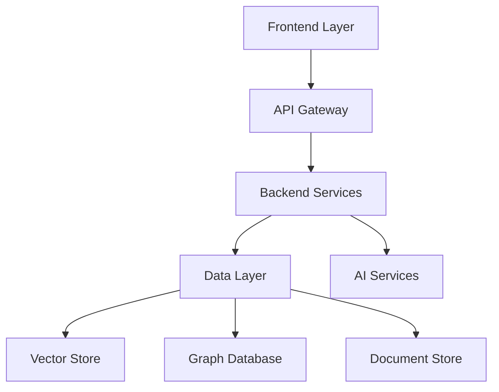

# KI-gestütztes QMS für Medizinprodukte (ISO 13485 / MDR)

> **Transformation von reaktivem zu proaktivem Qualitätsmanagement durch KI-Integration**

[](https://opensource.org/licenses/MIT)
[](https://www.python.org/downloads/)
[](https://fastapi.tiangolo.com/)
[](https://reactjs.org/)

## 📋 Inhaltsverzeichnis

- [🎯 Projektübersicht](#-projektübersicht)
- [⚡ Schnellstart](#-schnellstart)
- [🚀 MVP Quick Start](#-mvp-quick-start)
- [🏗️ Architektur](#️-architektur)
- [🔧 Installation](#-installation)
- [📚 Dokumentation](#-dokumentation)
- [🚀 Entwicklung](#-entwicklung)
- [📈 Roadmap](#-roadmap)
- [🤝 Mitwirken](#-mitwirken)

## 🎯 Projektübersicht

Ein modulares, KI-gestütztes Qualitätsmanagementsystem (QMS) für Medizinprodukte nach **ISO 13485** und **MDR**.

### Kernziele
- **70%** Reduzierung des administrativen Aufwands
- **90%** Verbesserung der Dokumentenkonsistenz
- **300-400%** ROI innerhalb von 24 Monaten
- Automatisierung von Compliance-Checks
- Demokratisierung von QM-Wissen

### Transformative Wirkung
| Vorher | Nachher |
|--------|---------|
| Dokumentenbasiert | Wissensbasiert |
| Reaktiv | Proaktiv |
| Manuell | Automatisiert |
| Statisch | Intelligent |

## ⚡ Schnellstart

### Systemanforderungen
- **Python** 3.11+
- **Node.js** 18+
- **Docker** & Docker Compose
- **Git**

### 🚀 In 5 Minuten startklar

```bash
# Repository klonen
git clone https://github.com/your-org/ki-qms.git
cd ki-qms

# Umgebung starten
docker-compose up -d

# Backend starten
cd backend && pip install -r requirements.txt
uvicorn app.main:app --reload

# Frontend starten
cd frontend && npm install && npm start
```

🎉 **Fertig!** Öffne [http://localhost:3000](http://localhost:3000)

## 🚀 MVP Quick Start

> **Für Entwickler, die sofort loslegen wollen - ohne Docker oder komplexe Datenbank-Setups!**

### ⚡ In 3 Minuten startklar (SQLite-Version)

```bash
# 1. Repository klonen
git clone https://github.com/your-org/ki-qms.git
cd ki-qms

# 2. Backend starten (SQLite + lokales AI)
cd backend
python -m venv venv
source venv/bin/activate  # Linux/Mac: venv\Scripts\activate (Windows)
pip install -r requirements-mvp.txt
python scripts/init_mvp_db.py  # SQLite DB mit Testdaten
uvicorn app.main:app --reload

# 3. Frontend starten (neues Terminal)
cd frontend
npm install
npm start
```

🎯 **Das war's!** Das MVP läuft vollständig lokal mit:
- ✅ SQLite-Datenbank (keine Installation nötig)
- ✅ Lokale KI-Modelle (offline-fähig)
- ✅ Vollständige Kernfunktionen
- ✅ Testdaten bereits geladen

📚 **Detaillierte Anleitung:** [MVP Phase 1 Implementierungsguide](docs/mvp-phase-1.md)

### 🔧 MVP-Features

| Feature | Status | Beschreibung |
|---------|--------|--------------|
| 📄 Dokumentenverwaltung | ✅ | Erstellen, bearbeiten, versionieren |
| 👥 Benutzerverwaltung | ✅ | Login, Rollen, Berechtigungen |
| 🔍 Volltextsuche | ✅ | SQLite FTS5 |
| 📊 Basic Analytics | ✅ | Dashboards, Statistiken |
| 🤖 KI-Grundfunktionen | ✅ | Offline-Embeddings, Text-Klassifikation |
| 📋 Kalibrierungsgrundlagen | ✅ | Equipment-Verwaltung, Termine |
| 🔐 **RBAC-System** | ✅ | **13 Interessensgruppen (inkl. externe Stakeholder), granulare Berechtigungen** |

### 🎯 MVP vs. Vollversion

| Komponente | MVP (SQLite) | Vollversion |
|------------|--------------|-------------|
| **Datenbank** | SQLite (1 Datei) | PostgreSQL + Neo4j + Pinecone |
| **KI/ML** | Lokal (Hugging Face) | Cloud + Lokal |
| **Setup-Zeit** | 3 Minuten | 15+ Minuten |
| **Abhängigkeiten** | Python + Node.js | Docker, Kubernetes, etc. |
| **Skalierung** | Bis ~1000 Dokumente | Unbegrenzt |

### 🛠️ MVP-Struktur

```
mvp-setup/
├── backend/
│   ├── requirements-mvp.txt    # Minimal dependencies
│   ├── app/
│   │   ├── main.py            # FastAPI app
│   │   ├── database_sqlite.py # SQLite configuration
│   │   └── models_simple.py   # Simplified models
│   └── scripts/
│       └── init_mvp_db.py     # DB setup with test data
└── frontend/
    └── src/
        └── config/
            └── mvp.ts         # MVP configuration
```

## 🏗️ Architektur

### System-Überblick


### Technologie-Stack

| Bereich | Technologie | Zweck |
|---------|-------------|--------|
| **Backend** | FastAPI + Python | REST API, Geschäftslogik |
| **Frontend** | React + TypeScript | Benutzeroberfläche |
| **Datenbank** | PostgreSQL + Neo4j + Pinecone | Strukturierte + Graph + Vector-Daten |
| **KI/ML** | PyTorch + LangChain | RAG, Embeddings, Analytics |
| **DevOps** | Docker + Kubernetes | Container, Orchestrierung |

## 🔧 Installation

### Entwicklungsumgebung

```bash
# 1. Repository setup
git clone https://github.com/your-org/ki-qms.git
cd ki-qms

# 2. Backend setup
cd backend
python -m venv venv
source venv/bin/activate  # Linux/Mac
pip install -r requirements.txt

# 3. Frontend setup
cd ../frontend
npm install

# 4. Datenbank setup
docker-compose -f docker-compose.dev.yml up -d
```

### Produktionsumgebung

```bash
# Mit Docker Compose
docker-compose -f docker-compose.prod.yml up -d

# Mit Kubernetes
kubectl apply -f k8s/
```

## 📚 Dokumentation

Die detaillierte technische Dokumentation wurde in separate Dateien ausgelagert:

| Dokument | Beschreibung |
|----------|--------------|
| [🚀 **MVP Phase 1 Guide**](docs/mvp-phase-1.md) | **Detaillierte Implementierungsanleitung Backend** |
| [📖 API-Dokumentation](docs/api.md) | REST API Endpunkte und Schemas |
| [🏗️ Architektur-Guide](docs/architecture.md) | Detaillierte Systemarchitektur |
| [🔧 Entwickler-Guide](docs/development.md) | Setup, Testing, Deployment |
| [📋 GAMP 5 Validierung](docs/validation.md) | IQ/OQ/PQ Protokolle |
| [🔒 Sicherheit](docs/security.md) | DSGVO, Zugriffskontrolle |
| [💡 Code-Beispiele](docs/examples.md) | Implementierungsbeispiele |
| [🗄️ Datenbank-Schema](docs/database.md) | Datenmodelle und Beziehungen |

## 🚀 Entwicklung

### Kernmodule

#### 1. 📄 Dokumentenmanagement
- Automatische Metadatenextraktion
- Versionierung & Änderungsverfolgung
- Semantische Suche
- Abhängigkeitsanalyse

#### 2. 🔄 Kalibrierungsmanagement
- Automatische Fristüberwachung
- Trendanalyse von Messdaten
- Digitale Nachweise
- Eskalationsmanagement

#### 3. 🧠 KI-Integration (RAG)
- Semantische Dokumentensuche
- Kontextbewusste Antworten
- Automatische Normenanalyse
- Gap-Detection

#### 4. 📊 Analytics & Reporting
- Echtzeit-Dashboards
- Prädiktive Analysen
- Compliance-Monitoring
- Automatische Berichte

### MVP Implementierung (3-Phasen-Ansatz)

> **Intelligente Reihenfolge: Backend → GenAI → RAG**

#### 🏗️ **Phase 1: Backend + Datenbank Foundation** (2-3 Wochen)

**Warum zuerst?** Klare Datenmodelle und stabile APIs sind das Fundament für alles weitere.

**Woche 1-2: Core Backend**
- [x] FastAPI Backend-Setup mit Pydantic
- [x] SQLite-Datenbank für MVP (einfacher Start)
- [ ] **Kernmodelle definieren:**
  ```python
  # Beispiel Datenmodelle
  class Document(BaseModel): ...
  class Norm(BaseModel): ...
  class Calibration(BaseModel): ...
  class User(BaseModel): ...
  ```
- [ ] **Stabile API-Endpunkte erstellen:**
  - `GET/POST /api/documents/`
  - `GET/POST /api/norms/`
  - `GET/POST /api/calibrations/`
  - `GET/POST /api/users/`
- [ ] Basis-CRUD-Operationen implementieren
- [ ] Erste Testdaten anlegen

**Woche 3: Testing & Validierung**
- [ ] Unit Tests für alle Modelle
- [ ] API-Tests mit FastAPI TestClient
- [ ] Datenbank-Migrations-System
- [ ] Minimal-Frontend für API-Testing

**✅ Erfolgskriterium:** Vollständige CRUD-Operationen über API testbar

---

#### 🤖 **Phase 2: GenAI Integration** (2-3 Wochen)

**Warum jetzt?** Backend läuft stabil, jetzt KI-Features ohne RAG-Komplexität testen.

**Woche 4-5: Simple GenAI**
- [ ] **OpenAI/Anthropic API integrieren**
- [ ] **Einfache KI-Abfragen implementieren:**
  - "Was ist ISO 13485?"
  - "Erkläre MDR Artikel 61"
  - "Welche Norm gilt für Lieferantenabkündigungen?"
- [ ] **KI-Service-Layer erstellen:**
  ```python
  class AIService:
      async def query_general(self, question: str) -> str
      async def analyze_document(self, content: str) -> Analysis
  ```
- [ ] Token-Management und Logging
- [ ] Rate-Limiting implementieren

**Woche 6: UX & Integration**
- [ ] Frontend Chat-Interface
- [ ] Conversation History
- [ ] Error Handling für AI-Services
- [ ] Streaming Responses (optional)

**✅ Erfolgskriterium:** Benutzer können KI-Fragen stellen und Antworten erhalten

---

#### 🧠 **Phase 3: RAG Implementation** (3-4 Wochen)

**Warum zum Schluss?** Komplexeste Komponente, benötigt stabiles Backend und AI-Integration.

**Woche 7-8: Vector Search Setup**
- [ ] **Embedding-System integrieren:**
  - Lokale Embeddings (sentence-transformers)
  - Vector Database (Chroma/SQLite-VSS für MVP)
- [ ] **Dokumenten-Indexierung:**
  ```python
  class DocumentIndexer:
      def index_document(self, doc: Document) -> List[Embedding]
      def search_similar(self, query: str) -> List[Document]
  ```
- [ ] Chunk-Strategien für verschiedene Dokumenttypen
- [ ] Metadata-Filtering

**Woche 9-10: RAG Implementation**
- [ ] **RAG-Pipeline erstellen:**
  - Retrieval: Relevante Dokumente finden
  - Augmentation: Kontext für GenAI aufbauen
  - Generation: Kontextbewusste Antworten
- [ ] **Übergang von Simple GenAI zu RAG:**
  ```python
  # Vorher: Nur GenAI
  await ai_service.query_general("Was ist ISO 13485?")
  
  # Nachher: RAG mit eigenen Dokumenten
  await rag_service.query_with_context("Was steht in unserer ISO 13485 Dokumentation?")
  ```
- [ ] Hybrid Search (Keyword + Semantic)
- [ ] Source Attribution (Quellenangaben)

**Woche 11: Optimization & Polish**
- [ ] Performance-Optimierung
- [ ] Advanced RAG Features (Re-ranking, etc.)
- [ ] Frontend Integration
- [ ] End-to-End Testing

**✅ Erfolgskriterium:** RAG beantwortet Fragen basierend auf eigenen Dokumenten

---

#### 🎯 **Vorteile dieser Reihenfolge:**

| Phase | Was läuft | Was getestet wird | Risiko |
|-------|-----------|-------------------|--------|
| **1: Backend** | CRUD, API, DB | Datenmodelle, Stabilität | 🟢 Niedrig |
| **2: GenAI** | + KI-Grundfunktionen | UX, Token-Management | 🟡 Mittel |
| **3: RAG** | + Kontextbewusste KI | Komplexe KI-Workflows | 🟠 Hoch |

#### 🚀 **Quick Wins pro Phase:**

**Nach Phase 1:** Voll funktionsfähiges QMS-Backend
**Nach Phase 2:** KI-gestütztes QMS mit allgemeinem Wissen  
**Nach Phase 3:** Vollständiges RAG-System mit eigenem Wissen

### Qualitätssicherung

- **Tests**: Mindestens 80% Coverage
- **Linting**: ESLint + Black + Ruff
- **Type Safety**: TypeScript + Pydantic
- **Code Reviews**: Pull Request Templates
- **Automatisierte Qualitätsprüfungen**: CI/CD Pipeline

## 📈 Roadmap

### Phase 1: MVP (Q3-Q4 2025) ✅
- Grundlegende Systemarchitektur
- Kernmodule (Dokumenten-, Kalibrierungsmanagement)
- Erste KI-Integration (Basis-RAG)
- GAMP 5 konforme Validierung

### Phase 2: Erweiterungen (Q1-Q3 2026)
- Erweiterte Analytics und Dashboards
- Mehrsprachigkeit
- Prozessautomatisierung (CAPA-Workflows)
- Erweiterte KI-Features (Gap-Detection)

### Phase 3: Optimierung (Q4 2026+)
- Performance-Optimierung
- Enterprise-Features
- Mobile Apps
- Erweiterte Integrationen

## 🤝 Mitwirken

Wir freuen uns über Beiträge! Siehe [CONTRIBUTING.md](CONTRIBUTING.md) für Details.

### Entwicklung starten

```bash
# Feature Branch erstellen
git checkout -b feature/dein-feature

# Änderungen committen
git commit -m "feat: neue Funktion hinzugefügt"

# Pull Request erstellen
git push origin feature/dein-feature
```

### Projektstruktur

```
ki-qms/
├── backend/          # FastAPI Backend
├── frontend/         # React Frontend
├── docs/            # Dokumentation
├── k8s/             # Kubernetes Manifests
├── scripts/         # Deployment Scripts
└── tests/           # E2E Tests
```

## 🔒 Sicherheit & Compliance

- **DSGVO-konform**: Datenschutz by Design
- **GAMP 5 validiert**: IQ/OQ/PQ Protokolle
- **ISO 13485**: Medizinprodukte-QMS
- **MDR-konform**: EU-Medizinprodukteverordnung
- **Audit-Trail**: Vollständige Nachverfolgbarkeit

## 📄 Lizenz

Dieses Projekt steht unter der [MIT Lizenz](LICENSE).

## 🆘 Support

- 📧 **E-Mail**: support@ki-qms.de
- 🐛 **Bug Reports**: [GitHub Issues](https://github.com/your-org/ki-qms/issues)
- 💬 **Diskussionen**: [GitHub Discussions](https://github.com/your-org/ki-qms/discussions)
- 📖 **Dokumentation**: [Wiki](https://github.com/your-org/ki-qms/wiki)

---

> **"KI-QMS: Vom Nachweis zum Vorsprung."**
> 
> Attacke! Qualität wartet nicht! 🚀 